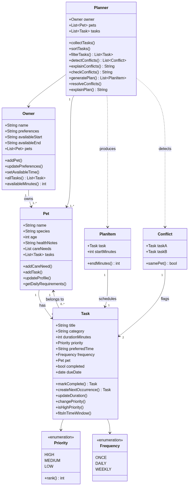

# PawPal+ (Module 2 Project)

You are building **PawPal+**, a Streamlit app that helps a pet owner plan care tasks for their pet.

## Scenario

A busy pet owner needs help staying consistent with pet care. They want an assistant that can:

- Track pet care tasks (walks, feeding, meds, enrichment, grooming, etc.)
- Consider constraints (time available, priority, owner preferences)
- Produce a daily plan and explain why it chose that plan

Your job is to design the system first (UML), then implement the logic in Python, then connect it to the Streamlit UI.

## 📐 System Design (UML)

The final class design for PawPal+, matching the code in `pawpal_system.py`:



> Source: [`diagrams/uml_final.mmd`](diagrams/uml_final.mmd)

## What you will build

Your final app should:

- Let a user enter basic owner + pet info
- Let a user add/edit tasks (duration + priority at minimum)
- Generate a daily schedule/plan based on constraints and priorities
- Display the plan clearly (and ideally explain the reasoning)
- Include tests for the most important scheduling behaviors

## Getting started

### Setup

```bash
python -m venv .venv
source .venv/bin/activate  # Windows: .venv\Scripts\activate
pip install -r requirements.txt
```

### Suggested workflow

1. Read the scenario carefully and identify requirements and edge cases.
2. Draft a UML diagram (classes, attributes, methods, relationships).
3. Convert UML into Python class stubs (no logic yet).
4. Implement scheduling logic in small increments.
5. Add tests to verify key behaviors.
6. Connect your logic to the Streamlit UI in `app.py`.
7. Refine UML so it matches what you actually built.

## 🖥️ Sample Output

Running `python main.py` builds a plan for two pets and resolves a deliberate 09:00
clash into a conflict-free day:

```text
========================================
TODAY'S SCHEDULE
========================================
07:30 — Morning walk (30 min) [pet: Rex, priority: high]
08:00 — Feed & fresh water (10 min) [pet: Luna, priority: high]
09:00 — Vet appointment (30 min) [pet: Rex, priority: high]
09:30 — Grooming (30 min) [pet: Luna, priority: medium]
18:00 — Dinner (15 min) [pet: Rex, priority: medium]
18:15 — Litter box cleaning (10 min) [pet: Luna, priority: low]
========================================
```

See the [Demo Walkthrough](#-demo-walkthrough) for the full run (sorting, filtering,
and conflict detection) alongside the Streamlit UI.

## 🧪 Testing PawPal+

python -m pytest

### What the tests cover

My test suite lives in `tests/test_pawpal.py` and contains **19 tests** grouped into three areas: data-model basics, core scheduling behavior, and edge cases. All tests share a `make_task()` helper (a high-priority daily "Morning walk" with overridable defaults) and a `make_planner()` helper (an owner available 07:00–20:00) so each test starts from a consistent fixture.

**Data-model basics** — a `Task` tracks its completion state (`completed` starts `False`, flips to `True` after `mark_complete()`), a `Pet` grows its task list on `add_task()`, and `add_task()` wires the task's `.pet` back-reference.

**Core scheduling behavior** — the three required behaviors are each pinned by a dedicated test:

- **Sorting correctness** (`test_sort_returns_chronological_order`) — equal-priority tasks are returned in chronological order by preferred time. A companion test confirms priority still wins over the clock (a HIGH task beats an earlier LOW one).
- **Recurrence logic** (`test_mark_complete_spawns_next_daily_occurrence`) — marking a daily task complete creates a fresh, incomplete copy due the following day and attaches it to the same pet. Sibling tests cover the weekly (+7 days) case and confirm a one-off (`ONCE`) task does **not** recur.
- **Conflict detection** (`test_two_tasks_at_exact_same_time_conflict`) — the Planner flags two tasks scheduled at the same time as a conflict. A companion test confirms overlaps are also caught across different pets.

Plus `test_owner_all_tasks_flattens_across_pets`, verifying the Planner sees every task across every pet.

**Edge cases** — a pet with no tasks (empty plan + friendly message), tasks that touch end-to-end (08:00–08:10 and 08:10–08:20 do *not* clash), a task with no preferred time (skipped in conflict checks), plan generation never producing overlaps, a task too long for the availability window (dropped), filtering by completion status and pet name (case-insensitive), a Planner with no owner (safe, no crash), and malformed time data degrading to a `WARNING` instead of raising.

Run the tests with `python -m pytest`, or directly via `python tests/test_pawpal.py`.

Sample test output:

PS C:\Users\chiom\.vscode\ai110-module2show-pawpal-starter> python -m pytest
=============================== test session starts ===============================
platform win32 -- Python 3.14.6, pytest-9.1.1, pluggy-1.6.0
rootdir: C:\Users\chiom\.vscode\ai110-module2show-pawpal-starter
plugins: anyio-4.14.0
collected 19 items                                                                 

tests\test_pawpal.py ...................                                     [100%]

=============================== 19 passed in 0.13s ================================
PS C:\Users\chiom\.vscode\ai110-module2show-pawpal-starter> 


My confidence level will probably be a 3, just because this is something a bit new to me but I trust the system's reliability to an extent based on my test results.


## 📐 Smarter Scheduling

PawPal+ goes beyond a flat task list with four scheduling behaviors. Each is
implemented on the `Planner` (or `Task`) classes in `pawpal_system.py`:

| Feature | Method(s) | Notes |
|---------|-----------|-------|
| Task sorting | `Planner.sort_tasks()` | Orders tasks by priority (high → low), then by preferred start time |
| Filtering | `Planner.filter_tasks()` | Filters by completion status and/or pet name (case-insensitive) |
| Conflict detection | `Planner.detect_conflicts()`, `Planner.explain_conflicts()`, `Planner.check_conflicts()` | Flags tasks whose time windows overlap; `Conflict` describes each clash |
| Recurring tasks | `Task.mark_complete()`, `Task.create_next_occurrence()` | Completing a daily/weekly task auto-schedules its next occurrence |

### Sorting behavior — `Planner.sort_tasks()`

Tasks are sorted by a two-part key: `Priority.rank` first (high-priority chores
come first), then the `preferred_time` converted to minutes since midnight
(tasks without a preferred time sort as `0`). `generate_plan()` calls this so
the resulting day is priority-ordered but still respects fixed time slots.

### Filtering behavior — `Planner.filter_tasks()`

Accepts two optional filters, `completed` and `pet_name`. Passing neither
returns every task; passing both keeps only tasks that satisfy *both*
conditions. `pet_name` is matched case-insensitively, so you can list, for
example, all of Luna's outstanding (incomplete) tasks.

### Conflict detection — `Planner.detect_conflicts()`

Each task occupies a half-open interval `[preferred_time, preferred_time +
duration_minutes)`. Two tasks conflict when their intervals overlap
(`start_a < end_b and start_b < end_a`) — touching end-to-end (e.g. `08:00–08:10`
and `08:10–08:20`) is *not* a clash. Conflicts are reported regardless of
whether the tasks belong to the same pet or different pets, since one owner
can't do both at once. Tasks without a `preferred_time` are skipped.

- `explain_conflicts()` returns a plain-language summary of the clashes.
- `check_conflicts()` is a best-effort variant that never raises — it degrades
  bad time data into a warning message rather than crashing the caller (useful
  for a UI banner). Each clash is represented by the `Conflict` dataclass, whose
  `same_pet` property and `__str__` produce a readable one-line description.

### Recurring task logic — `Task.mark_complete()` / `Task.create_next_occurrence()`

Marking a task complete calls `create_next_occurrence()`, which — for `DAILY`
and `WEEKLY` frequencies — creates a fresh, incomplete copy with its `due_date`
advanced (`+1 day` or `+7 days`, using `timedelta` so month/leap-year rollovers
are handled) and attaches it to the same pet. `ONCE` tasks return `None` and do
not repeat, so recurring chores reappear automatically while one-offs stay done.

## 📸 Demo Walkthrough

### The interface

PawPal+ runs as a Streamlit web app (`streamlit run app.py`, or
`python -m streamlit run app.py` if the `streamlit` command isn't on your PATH).
The page is a single scrolling form organized top-to-bottom around what a user can do:

- **Owner** — set the owner's name and their availability window (*Available from* /
  *Available until*, as `HH:MM`). The window bounds when tasks may be scheduled.
- **Add a Pet** — enter a pet's name, species, and age, then click **Add pet**. A live
  table lists every pet and how many tasks each one has.
- **Add a Task** — pick which pet the task is for, then give it a title, category,
  duration, priority (low/medium/high), preferred time, and frequency
  (once/daily/weekly). Click **Add task** to attach it to that pet.
- **Current tasks** — the task table auto-updates in *planning order* (sorted by the
  Planner), shows a conflict banner when preferred times overlap, and offers
  **Filter by pet** and **Filter by status** dropdowns plus at-a-glance metrics
  (tasks shown, total time, high-priority count).
- **Build Schedule** — click **Generate schedule** to produce a conflict-free daily
  plan, a plain-language explanation of it, and a conflict check.

### An example workflow

1. In **Owner**, keep *Jordan* (or rename) and set availability to `07:00`–`20:00`
   (widen the *Available from* field to `07:00` so the early `07:30` walk keeps its slot).
2. In **Add a Pet**, add `Rex` (dog, age 4) and click **Add pet**; add a second pet
   `Luna` (cat, age 2). Both appear in the pets table.
3. In **Add a Task**, add a high-priority daily `Morning walk` for Rex at `07:30`
   (30 min), then a high-priority `Feed & fresh water` for Luna at `08:00` (10 min).
4. Add two more tasks at the **same** preferred time — e.g. `Vet appointment` for Rex
   and `Grooming` for Luna, both at `09:00`. The **Current tasks** section immediately
   shows an amber ⚠️ conflict warning listing the overlapping pair.
5. Scroll to **Build Schedule** and click **Generate schedule**. The app spaces the
   clashing tasks out into a conflict-free plan, prints each task's start/end time, and
   shows an explanation of the ordering.

### Key scheduler behaviors this shows

- **Priority-then-time sorting** — the task table and plan list high-priority chores
  first, and order equal-priority tasks by preferred time.
- **Conflict warnings** — two tasks whose time windows overlap (even across different
  pets) trigger a warning, since one owner can't do both at once.
- **Automatic conflict resolution** — *Generate schedule* pushes clashing tasks later
  so the final plan never overlaps, while still respecting the availability window.
- **Filtering** — narrow the task view by pet and/or completion status.
- **Recurrence** — daily/weekly tasks are built to reappear on their next occurrence
  once completed (one-off tasks don't repeat).

### Sample CLI output (`python main.py`)

The `main.py` script exercises the same scheduling logic in the terminal with two pets
and a deliberate 09:00 conflict:

```text
========================================
TASKS AS ADDED (out of order)
========================================
18:00 — Dinner [pet: Rex, priority: medium]
07:30 — Morning walk [pet: Rex, priority: high]
09:00 — Vet appointment [pet: Rex, priority: high]
12:00 — Litter box cleaning [pet: Luna, priority: low]
08:00 — Feed & fresh water [pet: Luna, priority: high]
09:00 — Grooming [pet: Luna, priority: medium]

========================================
AFTER sort_tasks() (priority, then time)
========================================
07:30 — Morning walk [pet: Rex, priority: high]
08:00 — Feed & fresh water [pet: Luna, priority: high]
09:00 — Vet appointment [pet: Rex, priority: high]
09:00 — Grooming [pet: Luna, priority: medium]
18:00 — Dinner [pet: Rex, priority: medium]
12:00 — Litter box cleaning [pet: Luna, priority: low]

========================================
AFTER filter_tasks(pet_name='Luna')
========================================
08:00 — Feed & fresh water
09:00 — Grooming
12:00 — Litter box cleaning

========================================
AFTER filter_tasks(completed=False)
=======================================
07:30 — Morning walk
08:00 — Feed & fresh water
09:00 — Vet appointment
09:00 — Grooming
18:00 — Dinner
12:00 — Litter box cleaning

========================================
SCHEDULING CONFLICTS (check_conflicts())
========================================
WARNING: 1 scheduling conflict(s) found:
  - [different pets] 09:00-09:30 Vet appointment (Rex) overlaps 09:00-09:30 Grooming (Luna)

========================================
TODAY'S SCHEDULE
========================================
07:30 — Morning walk (30 min) [pet: Rex, priority: high]
08:00 — Feed & fresh water (10 min) [pet: Luna, priority: high]
09:00 — Vet appointment (30 min) [pet: Rex, priority: high]
09:30 — Grooming (30 min) [pet: Luna, priority: medium]
18:00 — Dinner (15 min) [pet: Rex, priority: medium]
18:15 — Litter box cleaning (10 min) [pet: Luna, priority: low]
========================================

Daily care plan for Amarachi:
  07:30 — Morning walk (30 min) [pet: Rex, priority: high]
  08:00 — Feed & fresh water (10 min) [pet: Luna, priority: high]
  09:00 — Vet appointment (30 min) [pet: Rex, priority: high]
  09:30 — Grooming (30 min) [pet: Luna, priority: medium]
  18:00 — Dinner (15 min) [pet: Rex, priority: medium]
  18:15 — Litter box cleaning (10 min) [pet: Luna, priority: low]
```

Notice the two 09:00 tasks: `check_conflicts()` flags them as a clash, but
**TODAY'S SCHEDULE** resolves it by pushing Grooming to `09:30` so the final plan
never overlaps.

**Screenshot or video** *(optional)*: to capture one, run `streamlit run app.py`, walk
through the [example workflow](#an-example-workflow) above, then screenshot the **Current
tasks** conflict banner and the **Build Schedule** output. Save it under `diagrams/` and
embed it here, e.g. ``.
